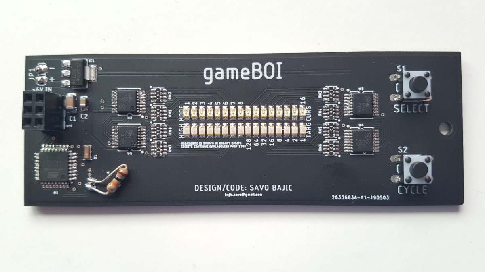

# gameBOI

My first personal circuit board project which I took on sort of like a hackathon to get done fast so I could show potential employers in the summer of 2019. Designed, ordered, assembled, programmed and debugged in the space of two weeks! Unfotunately I didn't get to show it off much given my limited number of interviews, but still proud of it.

*I initially forgot to buy one SMD resistor, so had to use a through-hole one.* 

## Hardware

The design is pretty simple looking back, basically the heart of an Arduino Nano with four shift registers daisy-chained to control the LEDs on board. There are two buttons for user input and two rows of 16 LEDs each resulting in the games and UI/UX being pretty simplistic. Power was supplied through a 9V battery that hung off the board going through a linear regulator.

I made two versions of the design, and commited to having the second built and assembled.

## Firmware

By replicating the heart of an Arduino Nano on the board, I could program it just like one through the Arduino IDE. One however was that instead of using a USB-UART interface and the Optiboot bootloader to program the chip, I used the AVR-ISP interface using an Arduino Uno as an ISP.

My code organization was pretty simple and I tried to make it easily scalable. I decided early on that I would make a seperate file for each sort of "stage" the user was in, so `mainmenu` and one for each different game (e.g. `stacker`), as well as one for all the shared functions like updating the screen so they could be maintained easier. *I now realize that what I had accidentally created was a Finite State Machine (FSM), and a project specific library.*

## Software Used

The board was designed in EAGLE (based on release dates, probably v9.4.0). Code was written in the Arduino IDE v1.8.9.
